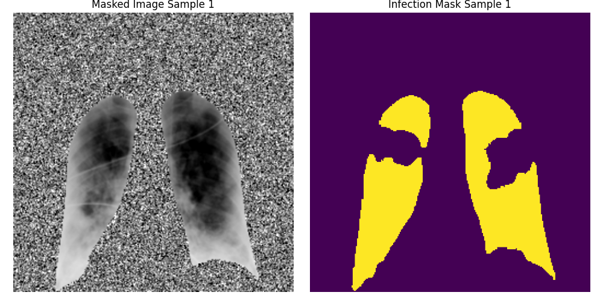
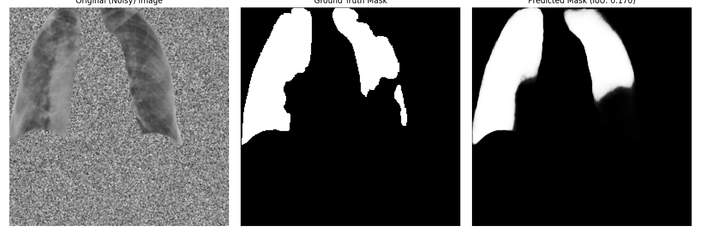

# COVID-19 Chest X-ray Classification with Source-Neutral Deep Learning

A robust deep learning approach for COVID-19 detection from chest X-rays using infection segmentation pretraining and source bias mitigation techniques.

## Project Overview

This project implements a two-stage transfer learning approach that achieves **86% accuracy** with demonstrated generalization across multiple independent datasets. The key innovation is addressing source bias - a critical issue where models learn dataset-specific artifacts rather than clinical features.

### Key Results
- **86% Test Accuracy** on internal held-out test set
- **89% External Validation Accuracy** across three independent datasets
- **Source-neutral predictions** across 9 different medical imaging sources
- Robust performance on Normal (90%), COVID (90%), and Viral Pneumonia (91%) cases

## Methodology

### Stage 1: Infection Segmentation Pretraining
The model first learns pixel-level infection patterns through semantic segmentation on COVID-QU-Ex dataset ground-truth masks.


*Ground truth infection segmentation masks from COVID-QU-Ex dataset*

  
*Model-predicted infection masks showing learned COVID-19 patterns*

**Architecture**: U-Net with EfficientNet-B4 encoder
**Objective**: Learn detailed, pixel-level COVID-19 infection features
**Training Strategy**: 
1. Phase 1 - COVID-positive samples only (focus learning)
2. Phase 2 - Full dataset including normal cases (generalization)

### Stage 2: Classification with Transfer Learning
The pretrained encoder is transferred to a classification task with a novel preprocessing pipeline designed to eliminate source bias.


*Lung-masked input images with noise background replacement*

**Key Innovation - Source Bias Mitigation**:
- **Lung Segmentation**: Isolate clinically relevant regions using pretrained lung segmentation model
- **Noise Background Replacement**: Replace non-lung pixels with normalized noise
- **Consistent Preprocessing**: Standardized normalization across all sources


*Final classification results showing model predictions with confidence scores*

## Technical Implementation

### Model Architecture
```
EfficientNet-B4 Encoder (from segmentation pretraining)
├── AdaptiveAvgPool2d(1)
├── Linear(1792 → 512) + ReLU + Dropout(0.5)
├── Linear(512 → 256) + ReLU + Dropout(0.4)  
├── Linear(256 → 128) + ReLU + Dropout(0.3)
└── Linear(128 → 1) [Binary Classification]
```

### Dataset Sources
- **Primary Training**: COVID-QU-Ex, COVID-19 Radiography Database
- **External Validation**: 
  - University of Denver COVID Dataset (603 images)
  - Paul Timothy Mooney Pneumonia Dataset (5,856 images)
  - NIH ChestX-ray14 subset

### Data Preprocessing Pipeline
1. **Lung Region Extraction**: Dynamic lung mask generation
2. **Background Noise Replacement**: Non-lung pixels → Gaussian noise (μ=0.53, σ=0.24)
3. **Standardized Augmentation**: Horizontal flip, rotation, brightness/contrast
4. **Per-Patient Splitting**: Prevents data leakage

## Source Bias Problem & Solution

### The Challenge
Initial models achieved 92% validation accuracy but failed catastrophically on external data due to source bias:
- Model learned "BIMCV images = COVID positive"  
- Model learned "RSNA images = COVID negative"
- High accuracy was actually measuring dataset artifacts, not clinical features

### Our Solution
1. **Lung-focused preprocessing** eliminates acquisition artifacts
2. **Source-stratified validation** catches bias during training  
3. **Balanced training** prevents source-label correlations
4. **External validation** on completely independent datasets

## Results Breakdown

### Internal Performance (Test Set)
```
Overall Accuracy: 86.3%
Overall F1-Score: 0.887

Source-wise Performance:
├── BIMCV: F1=0.867 (Mixed COVID/Normal cases)
├── Stonybrook: F1=0.999 (Clinical COVID cases)  
├── SIRM: F1=0.949 (Italian radiological data)
├── C19RD: F1=0.842 (Mixed pneumonia cases)
├── RSNA: F1=0.000 (Normal-only source, expected)
└── Cohen: F1=0.549 (Challenging research cases)
```

### External Validation Results
**University of Denver Dataset (N=603)**:
- COVID Cases: 89.6% accuracy
- Normal Cases: 89.7% accuracy  
- Viral Pneumonia: 90.5% accuracy

**Paul Timothy Mooney Dataset**: 93.8% specificity on bacterial/viral pneumonia

## Clinical Interpretation

The model demonstrates clinically meaningful behavior:
- **High specificity** on non-COVID pneumonia (avoiding false positives)
- **Robust generalization** across different imaging protocols
- **Source-neutral predictions** indicating focus on pathology rather than artifacts
- **Performance variation by clinical difficulty** (advanced COVID cases perform better than early-stage)

## Technical Contributions

1. **Novel Preprocessing Pipeline**: Lung masking + noise replacement for source bias mitigation
2. **Two-Stage Transfer Learning**: Segmentation pretraining → Classification fine-tuning  
3. **Source-Aware Validation**: Comprehensive evaluation framework preventing dataset overfitting
4. **Robust External Validation**: Testing on multiple independent datasets

## Limitations & Future Work

### Current Limitations
- **Inherent Task Difficulty**: COVID-19 often shows minimal/overlapping radiographic changes
- **Ground Truth Uncertainty**: PCR-positive patients may have normal X-rays
- **Performance Ceiling**: ~86% may approach theoretical maximum for CXR-based COVID detection

### Future Directions
- Multi-modal integration (clinical data + imaging)
- Uncertainty quantification for clinical decision support
- Temporal progression modeling
- Integration with larger foundation models

## Dependencies
- PyTorch 1.9+
- Albumentations
- OpenCV
- TensorFlow (for lung segmentation model)
- Segmentation Models PyTorch
- Pandas, NumPy, Matplotlib

## Usage
```python
# Load trained model
model = CovidClassifier(encoder_name="efficientnet-b4")
checkpoint = torch.load('best_classifier_model.pth')
model.load_state_dict(checkpoint['model_state_dict'])

# Preprocess and predict
dataset = CovidClassifierDataset(test_df, transform=val_transform)
predictions = model(dataset[0][0].unsqueeze(0))
probability = torch.sigmoid(predictions).item()
```

## Citation
If you use this work, please consider citing:
```
[Your paper citation when published]
```

## Acknowledgments
- COVID-QU-Ex dataset contributors
- Lung segmentation model: jprich1984/Lung_Segmentation
- University of Denver COVID dataset
- Various public chest X-ray repositories

---

**Note**: This model is for research purposes only and should not be used for clinical diagnosis without proper validation and regulatory approval.
